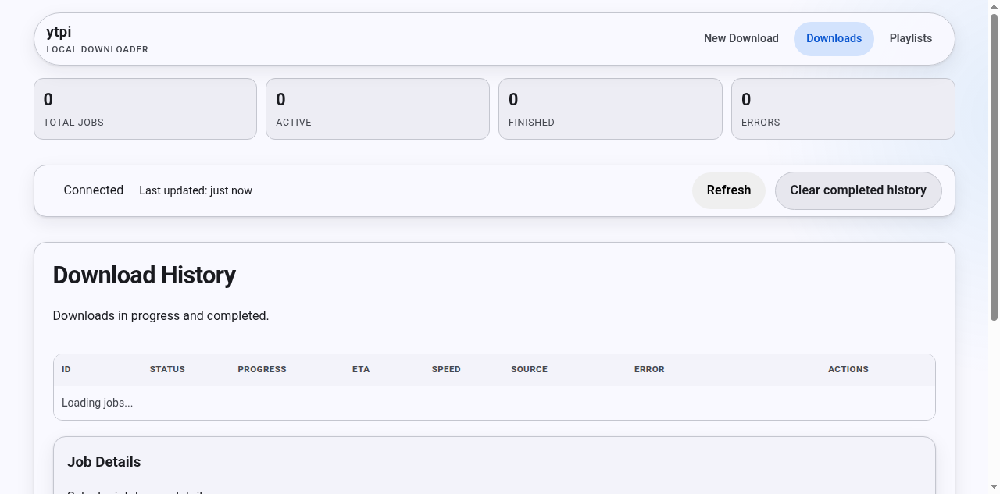

# YTPI

YTPI is a Flask-based local YouTube downloader for Raspberry Pi and LAN environments. It uses `yt-dlp` for downloads, persists queue/history data in SQLite, and provides a server-rendered web UI for queueing downloads and monitoring jobs.

The default security model is LAN-only access through a CIDR allowlist. It is not intended to be exposed directly to the public internet without an additional authenticated reverse proxy and a carefully scoped network configuration.

## Features

- Queue one or more YouTube video or playlist URLs.
- Download video as MP4 or extract audio as MP3/WAV.
- Choose quality, category, and custom destination folders.
- Persistent jobs and playlists in SQLite.
- Recover queued jobs after an application restart.
- Worker timeout, retry, cancel, and queue-limit handling.
- Live status dashboard with progress, output, job details, and playlist management.
- Concise error summaries in the history table while retaining technical diagnostics in job details.
- Material-style responsive UI with light/dark theme support and touch-friendly controls.
- CIDR allowlisting, URL validation, category path sanitization, and optional private-address blocking.
- JSON API, health/readiness probes, and an optional share-sheet endpoint.
- Docker deployment using Waitress, health checks, resource limits, and persistent bind mounts.
- Manually dispatched self-hosted deployment workflows for the systemd and Docker Compose installations.

## Screenshots



The dashboard provides job KPIs, connection status, download history, technical job details, and saved-playlist management. This capture shows the healthy empty state before any jobs have been queued.

## Quick Start

```bash
cp .env.example .env
python3 -m venv .venv
source .venv/bin/activate
pip install -r requirements.txt
python app.py
```

Open <http://localhost:7434>.

`python app.py` uses Flask's development server and is intended for local development. The Docker image runs the application with Waitress.

## Web UI

- `GET /` — queue a download.
- `GET /status` — view download history, progress, output, job details, and saved playlists.
- The queue form accepts one URL per line and supports video, playlist, and mixed submissions.
- Failed jobs show a short human-readable error in the table. Select a job to inspect its technical details rather than expanding the full downloader log into the table row.

## API

All requests, including API and probe endpoints, are subject to the configured CIDR allowlist.

### Queue downloads

```bash
curl -X POST http://localhost:7434/download \
  -H "Content-Type: application/json" \
  -d '{"url":"https://youtube.com/watch?v=VIDEO_ID","quality":"1080","category":"Music"}'
```

`/download` accepts JSON and standard form-encoded submissions. The web UI uses form encoding. JSON requests return `202` with a `job_id` for one URL or `job_ids` for multiple URLs. Successful form submissions redirect to `/status`, selecting the queued job when one job was created.

Accepted fields:

- `url` — one URL, or a newline/comma-separated string containing multiple URLs.
- `urls` — an array of URLs; alternatively accepted instead of `url`.
- `quality` — `max`, `2160`, `1440`, `1080`, `720`, or `480`; defaults to `max`.
- `category` — destination subfolder under `YTPI_DOWNLOADS_DIR`.
- `customCategory` — sanitized category name required when `category` is `__custom__`.
- `audio_only` — `true`, `1`, `yes`, or `on` to extract audio; audio downloads use the `audio-only` category.
- `audio_format` — `mp3` or `wav`; used only when `audio_only` is enabled and defaults to `mp3`.

Example audio-only request:

```bash
curl -X POST http://localhost:7434/download \
  -H "Content-Type: application/json" \
  -d '{"url":"https://youtube.com/watch?v=VIDEO_ID","audio_only":true,"audio_format":"mp3"}'
```

### Status and job data

- `GET /api/status?limit=200&offset=0&status=&category=&search=` — paginated JSON job history.
- `GET /job_output/<job_id>` — JSON details and output for one job.
- `POST /jobs/<job_id>/cancel` — cancel a queued or active job.
- `POST /jobs/<job_id>/retry` — retry a terminal failed job when retry policy allows it.
- `POST /clear-finished` — clear terminal jobs.

### Playlists

Playlists submitted through the queue are saved with their friendly title when yt-dlp reports one. The dashboard lets you edit the saved category, quality, audio-only mode, and audio format, then request a synchronization later.

- `GET /api/playlists` — list saved playlists and sync/result metadata.
- `PUT /api/playlists/<playlist_id>` — update playlist settings.
- `POST /api/playlists/<playlist_id>/sync` — queue a playlist synchronization.

Playlist sync state is tracked as the asynchronous job runs. The dashboard can show the requested, successful, and failed state plus discovered, downloaded, already-present, and failed item counts. Existing playlist titles are retained when a later yt-dlp response only provides the playlist ID.

### Health probes

- `GET /healthz` — liveness check for the database and workers.
- `GET /readyz` — readiness check for database health, worker health, writable downloads storage, and available queue capacity.

Both probes return JSON and HTTP `200` when healthy/ready or `503` otherwise.

## Share Sheet Endpoint

`GET /share` is retained for iOS shortcut compatibility. It is controlled by configuration and requires a share token when enabled:

- Set `YTPI_ENABLE_SHARE_GET=0` to disable the endpoint.
- Set `YTPI_SHARE_TOKEN` to require `?token=<token>`.
- If the endpoint is enabled without a token, requests are refused with `403`; it does not silently accept unauthenticated cross-site GET requests.

Example:

```bash
curl "http://localhost:7434/share?url=https://youtube.com/watch?v=VIDEO_ID&token=YOUR_TOKEN"
```

By default, successful share requests redirect to the selected job on `/status`. Add `redirect=0` to receive the shared-job success page instead.

## Configuration

Copy `.env.example` and override values as needed:

| Variable | Default | Purpose |
|---|---:|---|
| `YTPI_HOST` | `0.0.0.0` | Listen address. |
| `YTPI_PORT` | `7434` | Listen port. |
| `YTPI_DOWNLOADS_DIR` | `./downloads` | Root directory for downloaded media. |
| `YTPI_DB_PATH` | `./jobs.db` | SQLite database path. |
| `YTPI_ALLOWED_CIDRS` | private/local CIDRs | Source networks allowed to make requests. |
| `YTPI_TRUST_PROXY` | `0` | Read the forwarded client IP when set to `1`; use only behind a trusted proxy. |
| `YTPI_ENABLE_SHARE_GET` | `1` | Enable the legacy GET share route. |
| `YTPI_SHARE_TOKEN` | empty | Token required by `/share`; configure it when the endpoint is enabled. |
| `YTPI_MAX_QUEUE_SIZE` | `200` | Maximum number of active queued/downloading jobs. |
| `YTPI_MAX_WORKERS` | `1` | Number of download workers. `0` is useful for tests and disables downloads. |
| `YTPI_JOB_TIMEOUT_SECONDS` | `3600` | Per-job timeout; minimum accepted value is 30 seconds. |
| `YTPI_MAX_RETRIES` | `1` | Maximum retry count. |
| `YTPI_MAX_OUTPUT_CHARS` | `8000` | Maximum persisted downloader output per job. |
| `YTPI_JOB_RETENTION_HOURS` | `168` | Age-based job retention. |
| `YTPI_MAX_HISTORY_JOBS` | `2000` | Maximum retained history entries. |
| `YTPI_FFMPEG_PATH` | empty | Optional explicit `ffmpeg` path. |
| `YTPI_YTDLP_BIN` | `yt-dlp` | Downloader executable. |
| `YTPI_ENABLE_REMOTE_COMPONENTS` | `1` | Pass `--remote-components ejs:github` to yt-dlp. This requires live GitHub access and a supported JavaScript runtime. |
| `YTPI_BLOCK_PRIVATE_URLS` | `0` | Reject literal private, loopback, link-local, or reserved IP URLs. This does not resolve hostnames. |
| `YTPI_MAX_CONTENT_LENGTH` | `65536` | Maximum accepted Flask request body size in bytes. |

## Docker

Build and start the service:

```bash
docker compose up -d --build
```

Check the service:

```bash
docker compose ps
curl http://localhost:7434/healthz
curl http://localhost:7434/readyz
```

Stop and remove the test/service container without deleting bind-mounted data:

```bash
docker compose down
```

The default compose configuration:

- Publishes host port `7434` to container port `7434`.
- Stores SQLite data in the repository's `data/` directory.
- Mounts downloads from `${YTPI_HOST_DOWNLOADS_DIR}`.
- Falls back to `/mnt/usb0/samsung/media/YouTube` if `YTPI_HOST_DOWNLOADS_DIR` is not set.
- Includes a health check against `/healthz`.
- Runs with a 1 GB memory limit and two CPU limit.
- Restarts the container unless explicitly stopped.

Use a different media directory without editing the compose file:

```bash
YTPI_HOST_DOWNLOADS_DIR=/path/to/media docker compose up -d --build
```

The Docker entrypoint runs Waitress. `yt-dlp`, `ffmpeg`, and the Deno runtime used by remote yt-dlp components are included in the image.

## Security Notes

- Every request is checked against `YTPI_ALLOWED_CIDRS`.
- Set `YTPI_TRUST_PROXY=1` only when the application is behind a trusted reverse proxy that correctly sets the client IP header.
- Category names are sanitized and constrained below `YTPI_DOWNLOADS_DIR`.
- URL validation rejects unsupported URLs; enable `YTPI_BLOCK_PRIVATE_URLS=1` for additional literal-IP checks.
- Configure `YTPI_SHARE_TOKEN` before using `/share`.
- Do not expose the service directly to the public internet without adding authentication and a properly configured reverse proxy.

## Testing

Install development dependencies in the virtual environment, then run:

```bash
.venv/bin/pytest -q
```

Or, after activating the environment:

```bash
pytest -q
```

The Flask tests use temporary download/database paths, set `YTPI_MAX_WORKERS=0`, and make requests from an allowlisted localhost address. When writing new Flask tests, use `environ_base={"REMOTE_ADDR": "127.0.0.1"}` or another configured address.

## Project Structure

- `app.py` — development entrypoint and WSGI application export.
- `ytpi_app/config.py` — environment parsing, validation, URL/category helpers, and IP handling.
- `ytpi_app/routes.py` — web, API, share, job-control, and probe routes.
- `ytpi_app/repository.py` — SQLite persistence and migrations.
- `ytpi_app/manager.py` — queue, workers, subprocess execution, cancellation, retries, and output capture.
- `templates/` — server-rendered Jinja2 pages.
- `static/` — CSS and JavaScript for the dashboard and download form; there is no frontend build step.
- `tests/` — application, API, playlist, history, navigation, and worker behavior tests.
- `docker-compose.yml` and `Dockerfile` — container deployment.

## Local Development Notes

The access guard runs on every request. The default allowlist includes localhost and private IPv4 ranges. If you are testing through a trusted proxy or tunnel:

```bash
export YTPI_TRUST_PROXY=1
```

If your local network is not covered by the default allowlist, set an explicit list:

```bash
export YTPI_ALLOWED_CIDRS="127.0.0.0/8,::1/128,10.0.0.0/8,172.16.0.0/12,192.168.0.0/16"
```

## Dev Container

Use the provided `.devcontainer` configuration in VS Code, then run:

```bash
python app.py
```

The dev container forwards port `7434`. Run tests with `.venv/bin/pytest -q` or `pytest -q` after activating the environment.

## GitHub Actions

Two manually dispatched self-hosted workflows are included:

- `ytpi-workflow` copies the checkout to the configured service directory (default `/srv/ytpi`), installs dependencies, runs `pytest -q`, and restarts the systemd service.
- `ytpi-docker-workflow` synchronizes the checkout to its configured application directory (default `/srv/ytpi-docker`) while preserving deployment data, installs dependencies, runs `pytest -q`, recreates the Compose service, waits for the container health check, and probes `/healthz`.

These workflows are deployment-specific, require a self-hosted runner, and are triggered with `workflow_dispatch`. Configure the service paths and runner permissions for the target host before using them.
